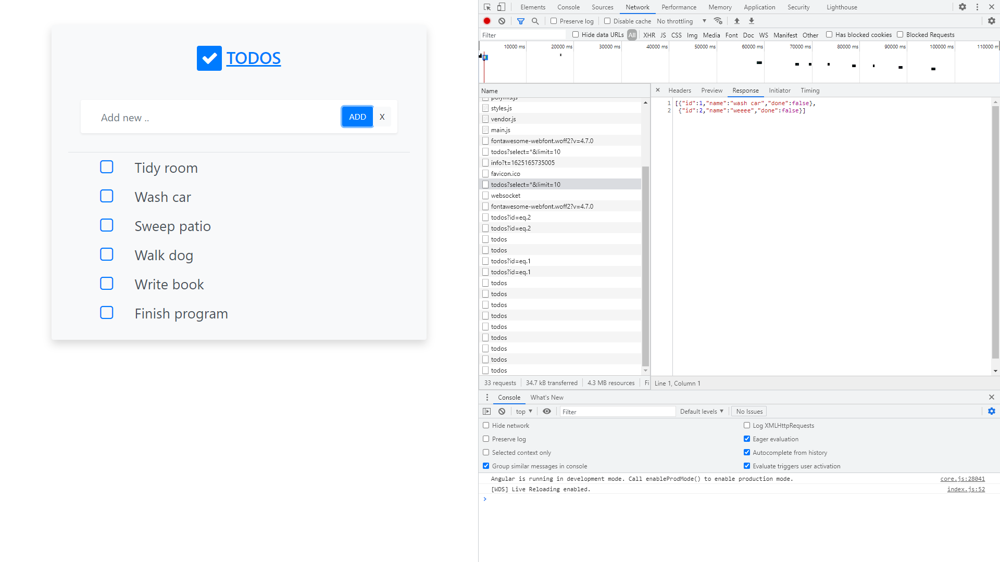

# Angular Supabase Data

* Angular frontend data entry form with with Supabase database backend

*** Note: to open web links in a new window use: _ctrl+click on link_**

## :page_facing_up: Table of contents

* [:zap: Angular RxJS ArcGIS](#zap-angular-rxjs-arcgis)
  * [:page_facing_up: Table of contents](#page_facing_up-table-of-contents)
  * [:books: General info](#books-general-info)
  * [:camera: Screenshots](#camera-screenshots)
  * [:signal_strength: Technologies](#signal_strength-technologies)
  * [:floppy_disk: Setup](#floppy_disk-setup)
  * [:flashlight: Testing](#flashlight-testing)
  * [:computer: Code Examples](#computer-code-examples)
  * [:cool: Features](#cool-features)
  * [:clipboard: Status & To-Do List](#clipboard-status--to-do-list)
  * [:clap: Inspiration](#clap-inspiration)
  * [:envelope: Contact](#envelope-contact)

## :books: General info

* Supabase

## :camera: Screenshots




## :signal_strength: Technologies

* [Angular v12](https://angular.io/)
* [Supabase public Beta](https://supabase.io/) open-source alternative to Firebase, but PostgreSQL instead of document database. Realtime, can use SQL joins. Realtime notifications via Websockets. RESTful API requires no backend code
* [Bootstrap v4]() styling
* [Font Awesome v4](https://fontawesome.com/v4.7/icons/) free icons

## :floppy_disk: Setup

* `npm i` to install dependencies then...
* Create free account with Supabase and create table using SQL option
* add Supabase credentials to `utils/initSupabase.ts`
* `ng serve` for a dev server. Navigate to `http://localhost:4200/` - app will automatically reload if you change any of the source files
* `ng build --prod` for a build folder

## :flashlight: Testing

* `ng test` to execute the unit tests via [Karma](https://karma-runner.github.io).
* `ng e2e` to execute the end-to-end tests via [Protractor](http://www.protractortest.org/).

## :computer: Code Examples

* This creates a table in Supabase SQL option

```typescript
create table todos (
 id bigint generated by default as identity primary key,
 name text check (char_length(name) > 0),
 done boolean default false,
);
```

## :cool: Features

* Supabase user interface is cool to work with and they have template SQL to create tables etc.

## :clipboard: Status & To-Do List

* Status: Working
* To-Do: Add fields like created & updated dates. Note: strict mode set to false due to database payload = null possibility - fix this this and set `tsconfig` strict back to true.
* To-Do: disable clear button when in edit mode.
* To-Do: add linting eslint

## :clap: Inspiration

* [Prasanna Kumar: Build a Todo app in React with Supabase - The Open-Source Firebase alternative](https://blog.prasanna.codes/build-a-todo-app-in-react-with-supabase-the-open-source-firebase-alternative) - to see how to create SQL table in Supabase
* [Diligent Dev: Supabase - The Open-source Alternative to Firebase](https://www.youtube.com/watch?v=RpnDkUMNzK0)

## :file_folder: License

* This project is licensed under the terms of the MIT license.

## :envelope: Contact

* Repo created by [ABateman](https://github.com/AndrewJBateman), email: gomezbateman@yahoo.com
